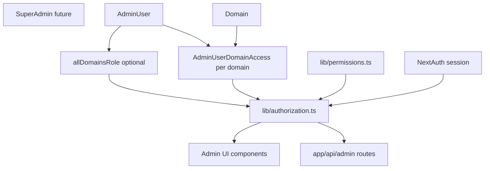

# Role-Based Team Management — Complete Implementation Spec (Phase 1)

> **Status:** Plan approved for implementation — do not start until user says "approve to implement".  
> **Repo rule:** Do not add this file to `real-estate/` (only `readme.md` allowed). Keep spec in `.cursor/plans/` or copy from this document.

---

## 1. Overview

Replace binary admin auth ("logged in = full access") with a **role + domain scope** system:

- **Four roles:** Admin, Executive, Member, Explorer
- **Scope:** Per-domain assignments OR optional **All domains** flag
- **Enforcement:** Authorization engine → **UI gates** + **API gates**
- **Team UI:** Admins create/edit/remove team members

**Not in Phase 1:** Platform SuperAdmin, ClientTenant table, email invites, OAuth, password reset emails.

---

## 2. Architecture



---

## 3. Role definitions

| Role | How much (role) | Where (scope) |
|------|-----------------|---------------|
| **Admin** | Full on scope: team, pages draft+published, leads, domain settings, create domain, global settings/webhooks | Per domain and/or **All domains** |
| **Executive** | Operational: pages, leads, domain branding/notify/homepage — no team, no domain create/delete, no globals | Per domain and/or **All domains** |
| **Member** | Edit **published** pages only — no drafts, publish, create, delete, archive, leads | Per domain and/or **All domains** |
| **Explorer** | Read-only published pages + view links | Per domain and/or **All domains** |

### Global resources (no `domainId` in DB)

Require **Admin** on at least one domain (or `allDomainsRole = admin`):

- `AdminUiSettings` — `/admin/settings`, `/api/admin/ui-settings`
- `WebhookConfig` — webhooks CRUD
- `POST /api/admin/master-templates/sync-from-pages`
- `POST /api/admin/domains` (create), `DELETE` domain

**Admin + Executive** (any domain access): templates list, create page from template.

---

## 4. All domains vs specific domains

### Data

```prisma
model AdminUser {
  id           String   @id @default(uuid())
  email        String   @unique
  passwordHash String
  name         String
  role         String   @default("admin")  // DEPRECATED — stop using in app
  allDomainsRole AdminDomainRole?         // null = scoped only
  createdById  String?
  createdAt    DateTime @default(now())
  updatedAt    DateTime @updatedAt
  domainAccess AdminUserDomainAccess[]
}

enum AdminDomainRole {
  admin
  executive
  member
  explorer
}

model AdminUserDomainAccess {
  id        String          @id @default(uuid())
  userId    String
  domainId  String
  role      AdminDomainRole
  createdAt DateTime        @default(now())
  updatedAt DateTime        @updatedAt
  user   AdminUser @relation(fields: [userId], references: [id], onDelete: Cascade)
  domain Domain    @relation(fields: [domainId], references: [id], onDelete: Cascade)
  @@unique([userId, domainId])
  @@index([domainId])
}
```

### Resolution (`loadUserAccess`)

1. If `user.allDomainsRole != null` → effective role on **every** `Domain.id` (including domains created later).
2. Else → use `AdminUserDomainAccess` rows only.
3. Login rejected if result is empty (no role anywhere).

### Seed / migration

- Backfill seed user: `allDomainsRole = admin`
- Deprecate `AdminUser.role` string column (keep for DB compat)

---

## 5. How Admin creates team members

### Access

- Nav: **Team** (`/admin/team`) — visible if `team:manage` (Admin on any domain)
- API: `POST /api/admin/team`

### UI flow

1. Admin opens **Team** → **Add team member**
2. Form fields:

| Field | Required | Notes |
|-------|----------|-------|
| Email | Yes | Unique login |
| Name | Yes | Display name |
| Password | Yes | Temporary; share manually (Phase 1) |
| Role | Yes | admin \| executive \| member \| explorer |
| **All domains** | Checkbox | ON = role on all domains now + future |
| **Domains** | If All domains OFF | Multi-select ≥1 domain |

3. Summary before save: e.g. `Executive on all domains` or `Member on 2 domains`
4. Save → creates `AdminUser` + sets `allDomainsRole` OR `AdminUserDomainAccess` rows
5. New user logs in at `/admin/login`

### API body examples

**All domains:**

```json
{
  "email": "exec@client.com",
  "name": "Core BBP",
  "password": "ChangeMe123!",
  "role": "executive",
  "allDomains": true
}
```

**Specific domains:**

```json
{
  "email": "trainer@client.com",
  "name": "Trainee",
  "password": "ChangeMe123!",
  "role": "member",
  "allDomains": false,
  "assignments": [
    { "domainId": "uuid-1", "role": "member" }
  ]
}
```

### Safeguards

- Only Admin with `team:manage` can POST/PATCH/DELETE team
- Cannot grant `allDomains` + `admin` unless caller is platform-level admin (`allDomainsRole=admin` or Admin on every domain)
- Cannot assign role above caller's level
- Cannot delete last user with `allDomainsRole=admin`
- Unchecking All domains requires ≥1 domain selected

---

## 6. Permission catalog (~40 IDs)

### A. Platform

| ID | Notes |
|----|-------|
| `platform:login` | Requires access |
| `platform:logout` | All roles |

### B. Team

| ID | Notes |
|----|-------|
| `team:list` | |
| `team:create` | |
| `team:update` | |
| `team:remove` | |
| `team:assign_role` | Escalation guard |

### C. Domains

| ID | Notes |
|----|-------|
| `domain:list` | |
| `domain:read` | |
| `domain:create` | Admin + global |
| `domain:delete` | Admin + global |
| `domain:update_settings` | Branding, notify, social, analytics |
| `domain:update_hostname` | Admin only |
| `domain:verify` | |
| `domain:status_read` | |
| `domain:default_homepage_write` | |
| `domain:default_homepage_backfill` | Admin only |

### D. Landing pages

| ID | Notes |
|----|-------|
| `pages:list_all_statuses` | Admin, Executive |
| `pages:list_published_only` | Member, Explorer |
| `pages:list_archived` | Admin, Executive |
| `pages:create` | |
| `pages:duplicate` | |
| `pages:reorder` | |
| `pages:view_draft_preview` | |
| `pages:view_live` | |
| `pages:edit_metadata` | Member: published only |
| `pages:edit_content` | Member: published only |
| `pages:edit_layout` | Member: published only |
| `pages:edit_form` | Member: published only |
| `pages:edit_seo` | Member: published only |
| `pages:edit_branding_override` | |
| `pages:edit_cta` | |
| `pages:edit_toast_override` | |
| `pages:edit_multistep_notify` | |
| `pages:publish` | |
| `pages:archive` | |
| `pages:restore` | |
| `pages:delete_permanent` | |
| `pages:multistep_picker` | |

### E. Leads

| ID | Notes |
|----|-------|
| `leads:list` | Read-only UI |

### F. Media

| ID | Notes |
|----|-------|
| `media:upload` | |
| `media:upload_signature` | |

### G. Templates

| ID | Notes |
|----|-------|
| `templates:list` | |
| `templates:create_page` | |
| `templates:sync_master` | Admin global |

### H. Webhooks

| ID | Notes |
|----|-------|
| `webhooks:list` | |
| `webhooks:create` | |
| `webhooks:update` | |
| `webhooks:delete` | |

### I. Settings

| ID | Notes |
|----|-------|
| `settings:global_read` | Fix: add auth today missing |
| `settings:global_write` | |
| `settings:page_cta` | |
| `integrations:resend_templates` | |

### J. Cache

| ID | Notes |
|----|-------|
| `cache:revalidate` | |

### K. Dashboard

| ID | Notes |
|----|-------|
| `dashboard:view` | |

---

## 7. Role → permission matrix

| Bundle | Admin | Executive | Member | Explorer |
|--------|:-----:|:---------:|:------:|:--------:|
| team:* | yes | | | |
| domain read/list/status | yes | yes | yes | yes |
| domain update_settings, default_homepage, verify | yes | yes | | |
| domain create/delete/hostname/backfill | yes | | | |
| pages full lifecycle (draft+) | yes | yes | | |
| pages edit published | yes | yes | yes | |
| pages view published | yes | yes | yes | yes |
| leads:list | yes | yes | | |
| templates list/create | yes | yes | | |
| templates:sync_master | yes | | | |
| webhooks:* | yes | | | |
| settings:global_* | yes | | | |
| media:upload | yes | yes | yes | |
| dashboard:view | yes | yes | yes | yes |

**Platform-global** checks: user has `allDomainsRole=admin` OR `admin` in any `AdminUserDomainAccess`.

---

## 8. API route → permission map

| Route | Method | Permission(s) |
|-------|--------|----------------|
| `/api/admin/team` | GET, POST | team:* |
| `/api/admin/team/[userId]` | PATCH, DELETE | team:* |
| `/api/admin/domains` | POST | domain:create |
| `/api/admin/domains/[id]` | PATCH | update_settings / update_hostname (split) |
| `/api/admin/domains/[id]` | DELETE | domain:delete |
| `/api/admin/domains/[id]/verify` | POST | domain:verify |
| `/api/admin/domains/[id]/status` | GET | domain:status_read |
| `/api/admin/domains/[id]/default-homepage` | POST | domain:default_homepage_write |
| `/api/admin/domains/default-homepage/backfill` | POST | domain:default_homepage_backfill |
| `/api/admin/pages` | POST | pages:create |
| `/api/admin/pages/[id]` | PATCH | field groups + pageStatus |
| `/api/admin/pages/[id]` | DELETE | archive / permanent |
| `/api/admin/pages/duplicate` | POST | pages:duplicate |
| `/api/admin/pages/reorder` | POST | pages:reorder |
| `/api/admin/pages/for-multistep` | GET | pages:multistep_picker |
| `/api/admin/webhooks` | POST | webhooks:create |
| `/api/admin/webhooks/[id]` | PATCH, DELETE | webhooks:update/delete |
| `/api/admin/ui-settings` | GET, PATCH | settings:global_* + **add session** |
| `/api/admin/resend/templates` | GET | integrations:resend_templates |
| `/api/admin/master-templates/sync-from-pages` | POST | templates:sync_master |
| `/api/admin/revalidate` | POST | cache:revalidate |
| `/api/upload`, `/api/upload/signature` | POST | media:upload + domain context |

**List queries:** `domainId: { in: accessibleDomainIds }`; Member/Explorer add `status: published`, `deletedAt: null`.

**Errors:** 401 no session; 403 insufficient permission.

---

## 9. Admin UI → permission map

| Route / component | Gate |
|-------------------|------|
| `/admin` Dashboard | dashboard:view |
| `/admin/domains` DomainsManager | domain:* per capability |
| `/admin/pages-2` LandingPagesV2Client | pages:* |
| `/admin/pages-2/archived` | archive/restore |
| `/admin/pages/[id]/edit` PageEditor | pages:edit_* + status |
| `/admin/templates` | templates:* |
| `/admin/settings` | settings:global |
| `/admin/webhooks` | webhooks:* |
| `/admin/leads` | leads:list (add to nav) |
| `/admin/team` TeamManager | team:* |
| AdminShell nav | hide items by can() |
| TitleEditor, SlugEditor, TypeEditor | pages:edit_metadata |

### PageEditor / PATCH rules for Member

- Allow PATCH only if `page.status === 'published'`
- Reject: `status`, `slug` change to draft path, `action=restore`, DELETE
- Allow: content, sections, layout, form, SEO on published page

### Explorer

- Server: redirect from edit page or load read-only
- Client: disable all saves and uploads

---

## 10. New / modified files

### New files

| Path | Purpose |
|------|---------|
| `lib/permissions.ts` | Permission IDs + ROLE_PERMISSIONS map |
| `lib/authorization.ts` | loadUserAccess, can, requireCapability, filterAccessibleDomainIds |
| `types/next-auth.d.ts` | Session types |
| `components/admin/AuthContext.tsx` | Client auth context |
| `components/admin/TeamManager.tsx` | Team CRUD UI |
| `app/admin/(protected)/team/page.tsx` | Team page |
| `app/api/admin/team/route.ts` | GET, POST |
| `app/api/admin/team/[userId]/route.ts` | PATCH, DELETE |
| `prisma/migrations/XXXX_role_based/migration.sql` | Schema |

### Modified files

| Path | Change |
|------|--------|
| `prisma/schema.prisma` | enum, join table, allDomainsRole |
| `prisma/seed.ts` | allDomainsRole admin |
| `lib/auth.ts` | Load access; reject empty |
| `app/admin/(protected)/layout.tsx` | Pass authContext |
| `components/admin/AdminShell.tsx` | Nav gates + Team link |
| All `app/api/admin/**/route.ts` | requireCapability |
| `app/api/upload/route.ts` | domain write check |
| `app/api/admin/ui-settings/route.ts` | session + permission |
| `components/admin/LandingPagesV2Client.tsx` | UI gates |
| `components/admin/PageEditor.tsx` | read-only / member gates |
| `components/admin/DomainsManager.tsx` | infra vs settings gates |
| Protected server pages | filter domains/pages |

---

## 11. `lib/permissions.ts` (structure)

```ts
export const PERMISSIONS = {
  TEAM_LIST: "team:list",
  // ... all IDs
} as const;

export type Permission = (typeof PERMISSIONS)[keyof typeof PERMISSIONS];

export type AdminDomainRole = "admin" | "executive" | "member" | "explorer";

export const ROLE_PERMISSIONS: Record<AdminDomainRole, readonly Permission[]> = {
  admin: [ /* all for domain + globals via hasPlatformAdmin */ ],
  executive: [ /* ops set */ ],
  member: [ /* published edit set */ ],
  explorer: [ /* read set */ ],
};

export function roleHasPermission(role: AdminDomainRole, perm: Permission): boolean;
export function hasPlatformAdmin(ctx: AuthContext): boolean;
```

---

## 12. `lib/authorization.ts` (structure)

```ts
export type AuthContext = {
  userId: string;
  email: string;
  allDomainsRole: AdminDomainRole | null;
  assignments: { domainId: string; role: AdminDomainRole }[];
};

export async function loadUserAccess(userId: string): Promise<AuthContext>;
export async function getAuthContext(): Promise<AuthContext | null>;
export async function requireAuth(): Promise<AuthContext>; // 401
export function can(ctx: AuthContext, perm: Permission, opts?: {
  domainId?: string;
  pageStatus?: "draft" | "published";
}): boolean;
export function requireCapability(...): void; // throws 403
export function getAccessibleDomainIds(ctx: AuthContext, perm?: Permission): string[];
export function getRoleForDomain(ctx: AuthContext, domainId: string): AdminDomainRole | null;
```

**PATCH `/api/admin/pages/[id]` helper:** parse body keys → required permissions; if Member and page is draft → 403.

---

## 13. Session / NextAuth

`types/next-auth.d.ts`:

```ts
interface Session {
  user: {
    id: string;
    email?: string | null;
    name?: string | null;
    allDomainsRole?: AdminDomainRole | null;
    domainAccess?: { domainId: string; role: AdminDomainRole }[];
  };
}
```

`lib/auth.ts`:

- `authorize`: bcrypt + load access; return null if no access
- `session` callback: **reload** access from DB (avoid stale roles)

---

## 14. Implementation order

1. Prisma schema + migration + seed (`allDomainsRole = admin` for seed user)
2. `lib/permissions.ts` + `lib/authorization.ts`
3. `lib/auth.ts` + `types/next-auth.d.ts`
4. Gate all `app/api/admin/**` + upload + ui-settings
5. `app/api/admin/team/**` + TeamManager + `/admin/team`
6. AuthContext + AdminShell nav gates
7. LandingPagesV2Client, PageEditor, DomainsManager, server page filters
8. Manual acceptance matrix (section 15)

---

## 15. Manual acceptance matrix

| Action | Admin | Executive | Member | Explorer |
|--------|:-----:|:---------:|:------:|:--------:|
| Team page | yes | no | no | no |
| All domains Executive | assign | n/a | n/a | n/a |
| Create page | yes | yes | no | no |
| Edit published | yes | yes | yes | no |
| See drafts in list | yes | yes | no | no |
| Publish | yes | yes | no | no |
| Leads | yes | yes | no | no |
| Domain branding PATCH | yes | yes | no | no |
| Create/delete domain | yes | no | no | no |
| Global settings | yes | no | no | no |

---

## 16. Future (out of scope)

- Email invite + set password
- Platform SuperAdmin + ClientTenant
- Member publish (TBD) — capability map only
- Lead status update API
- `LeadDispatchJob` Prisma model

---

## 17. Implementation todos

- [ ] schema-migration — enum, join table, allDomainsRole, seed
- [ ] permissions-lib — permissions.ts + authorization.ts
- [ ] session-auth — auth.ts + next-auth.d.ts
- [ ] api-gates — all admin routes + upload + ui-settings
- [ ] team-api-ui — team routes + TeamManager
- [ ] ui-gates — AuthContext, shell, editors, server filters
- [ ] acceptance-test — manual matrix section 15

---

*End of implementation spec.*
